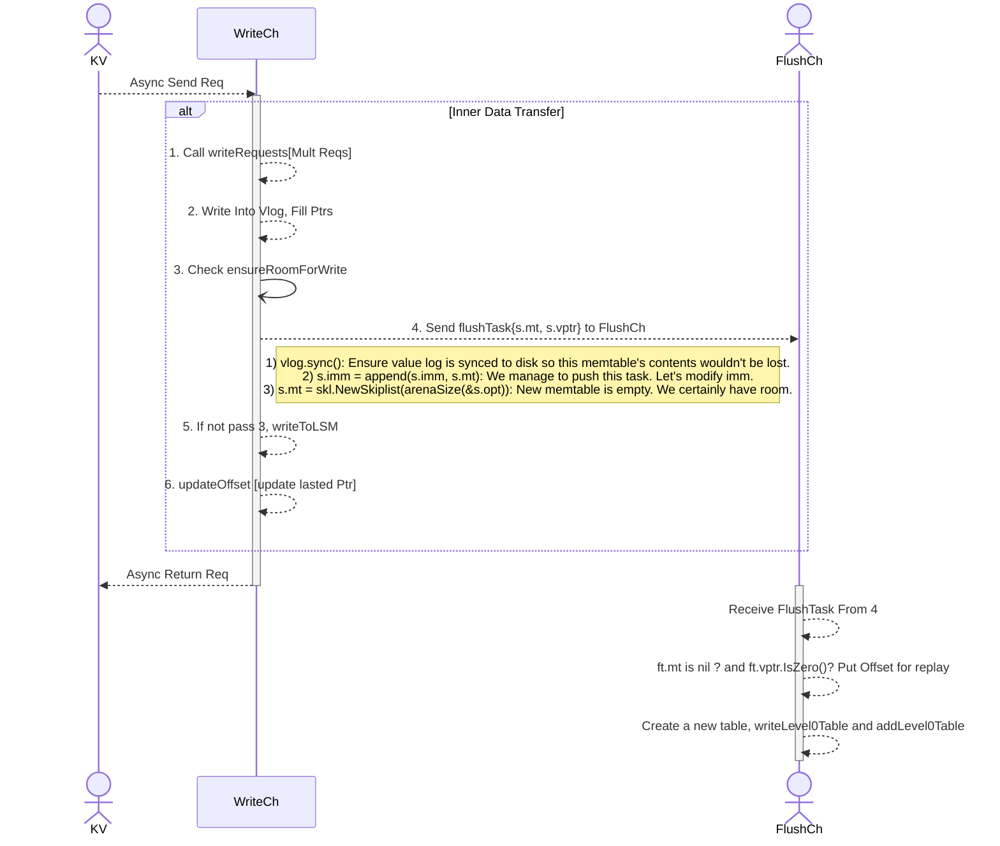

Put Key

```mermaid
%% Example of sequence diagram
  sequenceDiagram
actor KV
participant WriteCh
actor FlushCh
KV-->>WriteCh: Async Send Req
activate WriteCh
alt Inner Data Transfer
WriteCh-->>WriteCh: 1. Call writeRequests[Mult Reqs]
WriteCh -->>WriteCh: 2. Write Into Vlog, Fill Ptrs
WriteCh -)WriteCh: 3. Check ensureRoomForWrite
WriteCh -->>FlushCh: 4. Send flushTask{s.mt, s.vptr} to FlushCh
Note right of WriteCh: 1) vlog.sync(): Ensure value log is synced to disk so this memtable's contents wouldn't be lost.  <br/> 2) s.imm = append(s.imm, s.mt): We manage to push this task. Let's modify imm. <br/> 3) s.mt = skl.NewSkiplist(arenaSize(&s.opt)): New memtable is empty. We certainly have room.
WriteCh -->>WriteCh: 5. If not pass 3, writeToLSM
WriteCh-->>WriteCh: 6. updateOffset [update lasted Ptr]
end
WriteCh-->> KV: Async Return Req 
deactivate WriteCh 
activate FlushCh
FlushCh -->> FlushCh: Receive FlushTask From 4
FlushCh -->> FlushCh: ft.mt is nil ? and ft.vptr.IsZero()? Put Offset for replay
FlushCh -->> FlushCh: Create a new table, writeLevel0Table and addLevel0Table
deactivate  FlushCh
```

